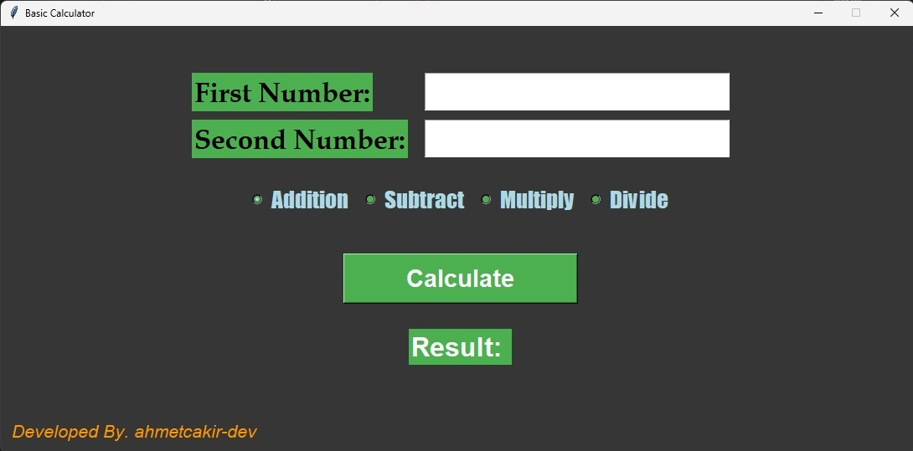

# Calculator in Python

A simple calculator project written in Python.  
This is my very first project while learning Python.  

## Features
- Addition  
- Subtraction  
- Multiplication  
- Division  

## Screenshot


## How to Run

1. Clone the repository:
   ```bash
   git clone https://github.com/your-username/calculator.git

2. Go into the project folder:
   ```bash
   cd calculator

3. Run the script:
   ```bash
   python calculator.py

## Notes

This is a beginner-level project.

I built it to practice Python basics.


## License

This project is licensed under the MIT License.
